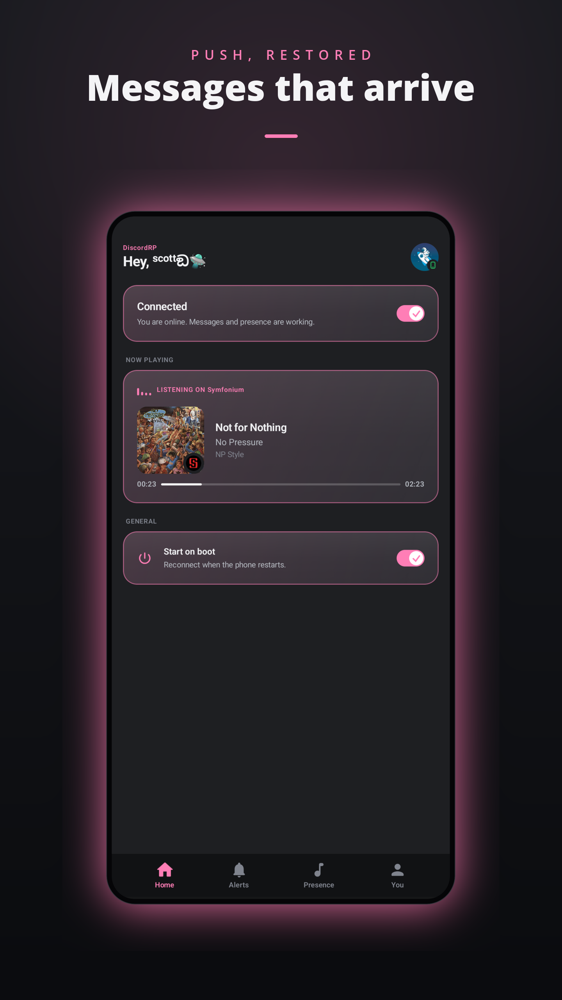
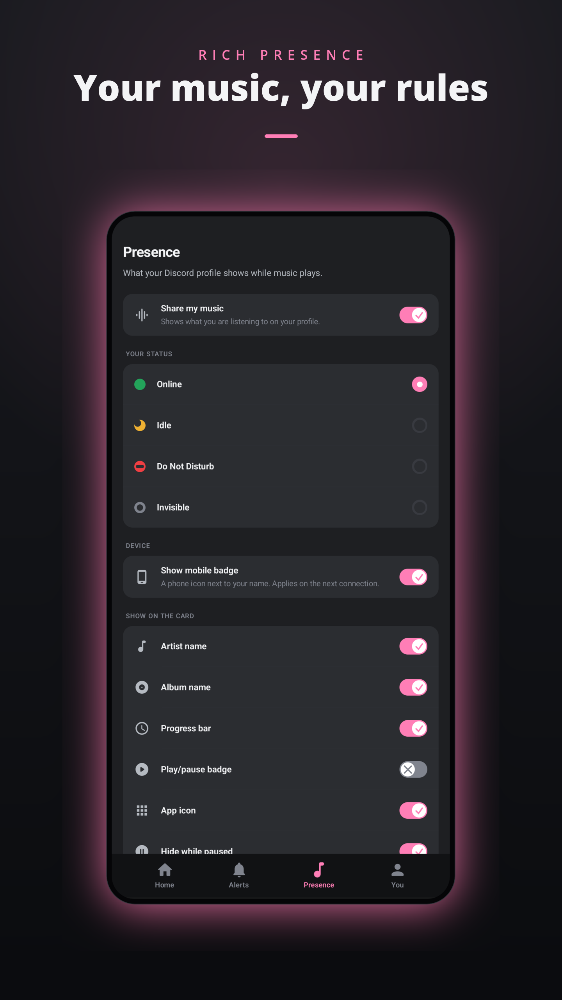
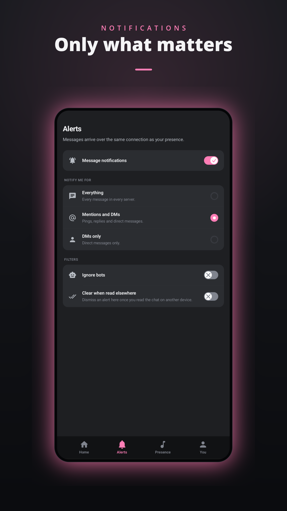

  

  <h1>DiscordRP</h1>
  <h4>Restore Push / Rich Presence</h4>

  
  
  

## About

DiscordRP is built for de-Googled Android in mind: GrapheneOS, CalyxOS, LineageOS and /e/OS.

DiscordRP keeps its own connection to Discord, so your messages arrive and the music you
play shows on your profile.

## Features

- [x] DMs and mentions as notifications
- [x] Music rich presence from any player, with album art
- [x] Cleans up song details from YouTube and NewPipe, so the uploader stops showing as the artist
- [x] Choose what notifies you: everything, mentions and DMs, or DMs only
- [x] Set your status and mobile badge from your phone
- [x] Starts on boot and stays connected

## Screenshots

  
  
  

## Download

Get the latest APK from [Releases](../../releases). Android 8.0 or newer, no Google account
or Play Services required.

> **Warning**
> This app uses the Discord gateway connection. Use it at your own risk.

## Setup

1. Install and open the app
2. Grant notification access and allow notifications
3. Sign in with Discord
4. Turn the connection on

Enable **Unrestricted battery** during setup. Aggressive battery management is the usual
reason messages stop arriving while the screen is off.

## Privacy

No analytics, no crash reporting, and no server in the middle. The app talks to Discord,
MusicBrainz, and the Cover Art Archive directly. Your login stays on the device and is
removed by signing out.

When a video app reports a song badly, the song and artist names are sent to MusicBrainz to
find out what is actually playing. Deezer is asked the same question only when MusicBrainz
cannot name the record, and never otherwise. Nothing identifying goes with either request, and
both can be turned off under **Presence, Song details**.

## Credits

The rich presence implementation draws on ideas from [Kizzy](https://github.com/dead8309/Kizzy)
by **dead8309**.

## License

[GPL-3.0](License)
